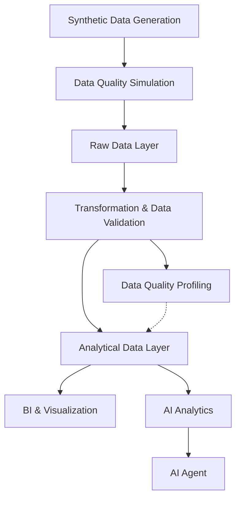
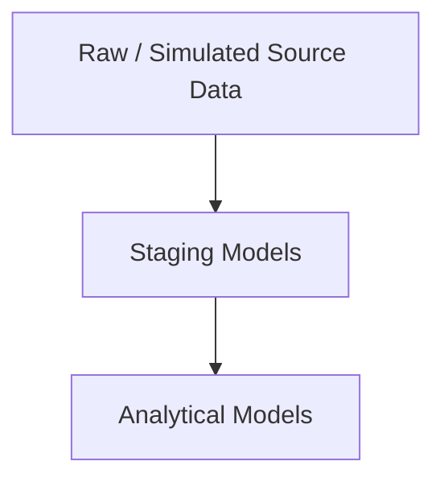

# MegaMart - End-to-End Retail Analytics & AI Data Platform
> A production inspired retail analytics platform built with Python, BigQuery, dbt, data quality engineering, and Model Context Protocol (MCP) powered AI analytics.

## Overview
MegaMart is an end-to-end synthetic retail analytics platform that simulates a modern supermarket and e-commerce data environment. The project deliberately introduces realistic data quality issues and processes the data through validation, transformation, analytics, machine learning preparation, business intelligence, and AI assisted analysis.

The platform demonstrates how **Business Data Analytics**, **Data Engineering**, **Analytics Engineering**, **Data Quality Engineering**, **Machine Learning**, and **AI tooling** can be integrated across a complete analytics lifecycle.

The project covers multiple interconnected business domains including:
- 👥 Customers
- 🛍️ Products
- 🏪 Stores
- 🧾 Transactions
- 📦 Inventory
- 🎯 Marketing Campaigns
- 🌐 Customer Sessions & Clickstreams
- 📈 Product Lifecycle & Version History

## Why MegaMart?
Many analytics projects begin with a clean dataset and end with a dashboard. Real world analytics workflows require substantially more work before data can be consumed and insights can be generated.

MegaMart is designed to demonstrate this broader workflow - from synthetic source generation and data quality engineering to analytical transformation, advanced analytics, and AI assisted data analysis.

Rather than focusing solely on dashbaord development, the project demonstrates how raw data can be systematically validated, transformed, analysed, and exposed for downstream analytical consumption.

## What This Project Demonstrates
MegaMart is designed as a **maintainable retail analytics platform** rather than a standalone dashboard. It brings together the layers needed to move from raw data to **trustworthy, reusable, and business ready analysis**.

| Capability | What MegaMart Does | Why It Matters |
|---|---|---|
| **Analytics** | Builds business facing datasets and analytical workflows across sales, customers, products, inventory, campaigns, segmentation, and forecasting. | Supports business ready analysis and actionable commercial insights from a consistent analytical foundation. |
| **Data Engineering** | Orchestrates data generation, quality simulation, validation, transformation, and analysis as a connected workflow. | Makes the data lifecycle reproducible, allowing the same process to be rerun across datasets and development environments. |
| **Analytics Engineering** | Organises transformations with modular dbt models, reusable tests, packages, metadata, and documented dependencies. | Creates a structured transformation layer that is easier to understand, maintain, test, and extend as the project grows. |
| **Data Quality Engineering** | Captures dbt test failures and profiling results, then surfaces affected records and business readable data quality insights. | Makes data issues visible and traceable before they influence downstream analysis. |
| **Python & AI Engineering** | Develops reusable Python components and MCP tools for data workflows, analytical operations, and controlled AI interaction. | Extends the platform beyond manual analysis by making analytical capabilities programmatically accessible. |

Together, these layers demonstrate how analytical work can be built as a **reproducible and maintainable system**, integrating data, transformation, quality, analysis, and AI access into a cohesive platform.

## Architecture


The architecture separates **data generation, data quality assessment, transformation, and analytical consumption**, with data quality profiling providing structured visibility into validation results before downstream analysis.

The resulting analytics environment supports both **traditional BI and analytical workflows** and **AI assisted data analysis**.

## End-to-End Workflow
MegaMart follows data through the complete analytical lifecycle, from generation to consumption.

### 1. Synthetic Data Generation
Generate interconnected synthetic datasets using **Python** with configurable volumes, deterministic random seeds, business rules, and referential relationships.

### 2. Data Quality Simulation
Simulate realistic source system imperfections by injecting controlled data quality issues, edge cases, and varying levels of data quality severity.

### 3. Data Ingestion & Warehousing
Ingest generated datasets into **Google BigQuery** as the cloud data warehouse, establishing the raw data layer.

### 4. Transformation & Data Validation
Use **dbt** to define SQL transformation models and a data quality validation framework through tests, reusable macros, and automated test execution. Validation results and failed records are persisted for downstream profiling.

### 5. Data Quality Profiling
Analyse the **dbt artifacts and persisted failure records** to quantify affected rows, failure rates, failure instances, and violated business rules.

Results are aggregated and presented in **Jupyter Notebook** to make data quality findings accessible to both technical and non technical stakeholders.

### 6. Data Cleaning & Analytical Transformation
Clean and standardise raw data into trusted analytical datasets using **dbt SQL models**, including standardisation logic, deduplication, data type handling, business rules, and derived fields to form the staging and analytical data layers.

### 7. Exploratory Data Analysis (EDA)
Perform statistical and visual analysis in **Python** using **Jupyter Notebook** to assess distributions, relationships, trends, patterns and anomalies across the transformed datasets.

### 8. Feature Engineering
Construct reusable analytical and **machine learning ready features** using **Python** and **SQL**, including derived metrics, customer attributes, behavioural indicators, and business KPIs.

### 9. Advanced Analytics & Machine Learning
Apply **predictive modelling**, **customer segmentation**, **forecasting**, and **association rule mining** to support business decision making.

### 10. Dashboarding & Business Intelligence
Develop interactive **Power BI** dashboards using dashboard ready datasets from the analytical data layer to monitor business KPIs, customer behaviour, sales performance, inventory, and other operational metrics.

### 11. MCP Analytics Tools
Build **Model Context Protocol (MCP)** tools that expose the analytical environment to AI agents, enabling programmatic access to business data, controlled querying, analytical workflows, and AI assisted business question answering.

```text
                    User
                      │
                      ▼
                  AI Agent
                      │
                      ▼
                  MCP Tools
                      │
          ┌───────────┼───────────┐
          ▼           ▼           ▼
       Sales      Inventory    Customers
       Tools        Tools        Tools
          │           │           │
          └───────────┼───────────┘
                      ▼
                   BigQuery
                      │
                      ▼
              Structured Results
                      │
                      ▼
              Grounded Explanation
```

The design emphasises **controlled access** rather than unrestricted database access. MCP tools define the available analytical capabilities while supporting:

- **least-privilege access**
- **controlled capabilities**
- **structured inputs and outputs**
- **validation**
- **traceability**
- **business-specific analytical logic**

This provides a governed interface between AI agents and the underlying analytics environment.

## Engineering Focus
MegaMart focuses on three key engineering questions:

- **Data Quality & Reliability**: How can data quality issues be detected, measured, and handled before they affect downstream analysis?
- **Data Preparation**: How can raw source data be transformed into trusted, reusable analytical datasets?
- **AI Access**: How can analytical data be exposed to AI systems in a controlled and explainable way?

## Business Questions MegaMart Can Answer
MegaMart supports analysis across key retail domains:

### Sales & Commercial Performance
- How is revenue changing over time?
- Which stores, channels, and categories contribute most to revenue?
- What factors are associated with changes in sales performance?

### Customers
- Which customer segments have the highest value?
- How do purchasing patterns differ across customer segments?
- Which customers show signs of declining engagement?

### Products
- Which products have the strongest and weakest performance?
- Which products are frequently purchased together?
- How does product performance change across stores and channels?

### Marketing
- Which campaigns generate the strongest engagement and conversion?
- Which customer segments respond best to different campaigns?
- How does campaign performance vary across channels?

### Inventory & Demand
- Which products are at risk of stockouts?
- Where do inventory levels diverge from observed demand?
- What demand patterns can support inventory planning?

## Data Modelling Approach
MegaMart uses a layered data modelling approach in **dbt** to progressively transform simulated source data into trusted analytical datasets.


- **Raw / Simulated Source Data** — Generated retail datasets containing intentionally simulated data quality issues.
- **Staging Models** — Standardise source data, handle data types and duplicates, and apply foundational business rules.
- **Analytical Models** — Build reusable business entities, metrics, relationships, and derived fields for downstream **BI**, **feature engineering**, **machine learning**, and **AI assisted analytics**.

## Core Technology Choices
MegaMart uses different technologies for different stages of the analytics lifecycle. Each tool has a defined role within the project.

### Why BigQuery?
BigQuery is MegaMart's cloud data warehouse, where generated and transformed retail data is stored and queried for analytical workloads.

It was chosen for:
- Scalable analytical SQL
- Cloud native data storage and processing
- Separation of storage and compute
- Support for large analytical workloads

Although MegaMart uses synthetic data at portfolio scale, the architecture follows patterns that can scale beyond the demonstration dataset.

### Why dbt?
dbt manages MegaMart's SQL transformation and data quality logic. It turns SQL transformation into version controlled, testable, and documented data models.

MegaMart uses dbt for:
- SQL transformation and dependency management
- Data quality testing
- Reusable macros
- Documentation and metadata
- Persisted test failures

### Why Python?
Python is used extensively across MegaMart for tasks that require procedural logic, orchestration, or integration beyond SQL.

MegaMart uses Python for:
- Synthetic data generation and business rules
- Data quality profiling and failure analysis
- Notebook based analysis and visualisation
- Feature engineering
- Predictive modelling and advanced analytics
- MCP integration

These three tools form the project's **core data engineering and analytics foundation**.

## Supporting Practices

The technical workflow is supported by engineering and project management practices throughout the project.

- **Project Management** - Planning, milestones, sprint management, and task tracking using Jira and Confluence.
- **Engineering & Quality Practices** - Automated testing, CI/CD, dependency management, pre-commit checks, and reproducible workflows.
- **Documentation & Knowledge Management** - Architecture, methodology, technical decisions, debugging guides, implementation notes, and user documentation using Confluence and GitHub.
- **Version Control** - Source controlled code, configuration driven workflows, deterministic data generation, and repeatable workflows.

> - Orchestration → `run_all.py` coordinates the workflow
> - Automation → `.github/workflows/` validates changes through CI/CD
> - Testing → `tests/` provides automated tests for synthetic data generation and its business rules

## Scale & Reproducibility
MegaMart supports **configurable dataset sizes** for development and larger production style runs. Dataset volumes, business entities, and generation parameters can be adjusted through configuration.

The synthetic data generation uses a fixed random seed, while transformation logic, project configuration, dependencies, and workflows are version controlled. This allows the same data characteristics and analytical environment to be reproduced across runs.

The current synthetic data period spans **1 January 2023** to **31 December 2025**.

## Getting Started - User Manual
The following steps cover the core data generation, transformation, data quality, and exploratory analysis workflow. Machine learning notebooks, Power BI dashboards, and MCP analytics are documented separately.

### 1. Clone the Repository
```bash
git clone https://github.com/jenniferwxe/MegaMart.git
cd MegaMart
```

### 2. Create the Python Environment
On Mac:
```bash
python -m venv venv
source venv/bin/activate
```
On Windows (Command Prompt):
```bash
venv\Scripts\activate
```

### 3. Install Dependencies
```bash
pip install -r requirements.txt
```

### 4. BigQuery Setup
Configure Google Cloud credentials and ensure the target BigQuery project is available.
- **Project:** `mega-mart-storage`
- **Region:** `asia-southeast1`

The project uses the following datasets:
- `synthetic_dirty` - simulated dirty source environment
- `synthetic_dirty_dbt_test__audit` - persisted dbt test failures used by the profiling workflow

### 5. Generate the Data
Run the synthetic data generation and data quality simulation workflows:

```bash
python -m data_generation.generation_runner
python -m dirty_data_generation.run_dirty_generation
```

The first workflow generates the synthetic retail datasets. The second applies controlled data quality issues to simulate imperfect source data.

The generator should use the configured random seed `42` for reproducibility.

### 6. Run the Data Quality Profiling Workflow
From the repository root:

```bash
python -m dirty_data_profiling.run_profiling
```

The workflow:
1. Executes `dbt run` and `dbt test` with failure records persisted.
2. Loads **dbt artifacts** and validation results.
3. Loads persisted failure records from BigQuery.
4. Calculates dataset level data quality statistics.
5. Builds structured **data quality profiles** and insights.
6. Generates and exports the profiling report.

### 7. Analyse the Profiling Results
Open:

```text
dirty_data_profiling/notebook/01_dirty_data_profiling.ipynb
```
Click `Run All` to execute all cells, load the profiling outputs, and generate the data quality analysis and visualisations.

The notebook consumes the outputs of the profiling workflow rather than  recreating the dbt validation logic.
> - dbt = source of truth for validation
> - Python profiler = structured interpretation of validation results
> - Jupyter Notebook = analysis and visualisation

## Documentation
> - [Confluence Documentation](https://jenniferwxe.atlassian.net/wiki/spaces/MM/overview)
