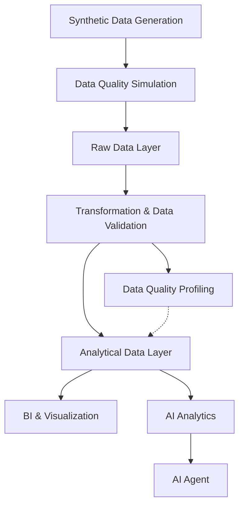

# MegaMart - End-to-End Retail Analytics & AI Data Platform
> A production inspired retail analytics platform built with Python, BigQuery, dbt, data quality engineering, and Model Context Protocol (MCP) powered AI analytics.

## Overview
MegaMart is an end-to-end synthetic retail analytics platform that simulates a modern supermarket and e-commerce data environment. The project deliberately introduces realistic data quality issues and processes the data through validation, transformation, analytics, machine learning preparation, business intelligence, and AI assisted analysis.

The platform demonstrates how **Business Data Analytics**, **Data Engineering**, **Analytics Engineering**, **Data Quality Engineering**, **Machine Learning**, and **AI tooling** can be integrated across a complete analytics lifecycle.

The project covers multiple interconnected business domains including:
- 👥 Customers
- 🛍️ Products
- 🏪 Stores
- 🧾 Transactions
- 📦 Inventory
- 🎯 Marketing Campaigns
- 🌐 Customer Sessions & Clickstreams
- 📈 Product Lifecycle & Version History

## Why MegaMart?
Many analytics projects begin with a clean dataset and end with a dashboard. Real world analytics workflows require substantially more work before data can be consumed and insights can be generated.

MegaMart is designed to demonstrate this broader workflow - from synthetic source generation and data quality engineering to analytical transformation, advanced analytics, and AI assisted data analysis.

Rather than focusing solely on dashbaord development, the project demonstrates how raw data can be systematically validated, transformed, analysed, and exposed for downstream analytical consumption.

## What This Project Demonstrates
MegaMart is designed as a **maintainable retail analytics platform** rather than a standalone dashboard. It brings together the layers needed to move from raw data to **trustworthy, reusable, and business ready analysis**.

| Capability | What MegaMart Does | Why It Matters |
|---|---|---|
| **Analytics** | Builds business facing datasets and analytical workflows across sales, customers, products, inventory, campaigns, segmentation, and forecasting. | Supports business ready analysis and actionable commercial insights from a consistent analytical foundation. |
| **Data Engineering** | Orchestrates data generation, quality simulation, validation, transformation, and analysis as a connected workflow. | Makes the data lifecycle reproducible, allowing the same process to be rerun across datasets and development environments. |
| **Analytics Engineering** | Organises transformations with modular dbt models, reusable tests, packages, metadata, and documented dependencies. | Creates a structured transformation layer that is easier to understand, maintain, test, and extend as the project grows. |
| **Data Quality Engineering** | Captures dbt test failures and profiling results, then surfaces affected records and business readable data quality insights. | Makes data issues visible and traceable before they influence downstream analysis. |
| **Python & AI Engineering** | Develops reusable Python components and MCP tools for data workflows, analytical operations, and controlled AI interaction. | Extends the platform beyond manual analysis by making analytical capabilities programmatically accessible. |

Together, these layers demonstrate how analytical work can be built as a **reproducible and maintainable system**, integrating data, transformation, quality, analysis, and AI access into a cohesive platform.

## Architecture


The architecture separates **data generation, data quality assessment, transformation, and analytical consumption**, with data quality profiling providing structured visibility into validation results before downstream analysis.

## Workflow
MegaMart follows data through the complete analytical lifecycle, from generation to consumption.

### 1. Synthetic Data Generation
Generate interconnected synthetic datasets using Python with configurable volumes, deterministic random seeds, business rules, and referential relationships.

### 2. Dirty Data Injection
Inject controlled data quality issues using Python to simulate realistic source system imperfections, edge cases, and varying levels of data quality severity.

### 3. Data Ingestion & Warehousing
Ingest generated datasets into **Google BigQuery** as the cloud data warehouse, establishing the raw data layer.

### 4. dbt Transformation & Testing
Use dbt to define the transformation pipeline and data quality framework through SQL models, validation tests, reusable macros, and automated test execution.

### 5. Data Quality Profiling
Execute dbt tests with stored failures, then extract and analyse **dbt artifacts and failure records** to quantify affected rows, failure rates, failure instances, and violated business rules.

Results are aggregated and presented in **Jupyter Notebook** to make data quality findings accessible to both technical and non-technical stakeholders.

### 6. Data Cleaning & Transformation
Clean and standardise raw data into trusted analytical datasets using dbt SQL models, standardisation logic, deduplication, data type handling, business rules, and derived fields to form a staging layer.

### 7. Exploratory Data Analysis (EDA)
Perform statistical and visual analysis in Python using Jupyter Notebook to assess distributions, relationships, trends, patterns and anomalies across the transformed datasets.

### 8. Feature Engineering
Construct reusable analytical and machine learning ready features using Python and SQL, including derived metrics, customer attributes, behavioural indicators, and business KPIs.

### 9. Advanced Analytics & Machine Learning
Apply predictive modelling, customer segmentation, forecasting, and association-rule mining to support business decision making.

### 10. Dashboarding & Business Intelligence
Develop interactive Power BI dashboards using dashboard ready datasets from the production analytical layer to monitor business KPIs, customer behaviour, sales performance, inventory, and other operational metrics.

### 11. MCP Analytics Tools
Build Model Context Protocol (MCP) tools that expose the analytical environment to AI agents, enabling programmatic access to business data, controlled querying, analytical workflows, and AI assisted business question answering.

## Supporting Practices
The technical workflow is supported by engineering and project-management practices throughout the project.
- **Project Management** - planning, milestones, sprint management, and task tracking using Jira and Confluence.
- **Engineering & Quality Practices** - automated testing, validation, CI/CD, dependency management, pre-commit checks, and reproducible workflows using Python, GitHub Actions, and development tooling.
- **Documentation & Knowledge Management** - architecture, documentation, methodology, technical decisions, debugging guides, implementation notes, and user documentation using Confluence and GitHub repository documentation.
- **Version Control** - source controlled code, configuration driven workflows, deterministic data generation, and repeatable development and production runs.

## Scale & Reproducibility
MegaMart supports **configurable dataset sizes** for development and larger production style runs. Dataset volumes, business entities, and generation parameters can be adjusted through configuration.

The current synthetic data period spans **1 January 2023** to **31 December 2025**. A fixed random seed ensures deterministic generation, allowing the same environment and data characteristics to be reproduced across runs while supporting large scale dataset generation.

## User Manual
The following steps cover the core data generation, transformation, data quality, and exploratory analysis workflow. Machine learning notebooks, Power BI dashboards, and MCP analytics are documented separately.

### 1. Clone the Repository
```bash
git clone https://github.com/jenniferwxe/MegaMart.git
cd MegaMart
```

### 2. Create the Python Environment
On Mac:
```bash
python -m venv venv
source venv/bin/activate
```
On Windows (Command Prompt):
```bash
venv\Scripts\activate
```

### 3. Install Dependencies
```bash
pip install -r requirements.txt
```

### 4. BigQuery Setup
Configure Google Cloud credentials and ensure the target BigQuery project is available.
- **Project:** `mega-mart-storage`
- **Region:** `asia-southeast1`

The project uses the following datasets:
- `synthetic_dirty` - dirty source environment
- `synthetic_dirty_dbt_test__audit` - persisted dbt test failures used by the profiling workflow

### 5. Generate the Data
Run the project's data generation workflow:
```bash
python -m data_generation.generation_runner
python -m dirty_data_generation.run_dirty_generation
```
The generator should use the configured random seed `42` for reproducibility.

### 6. Run dbt
From the repository root, enter the dbt project:
```bash
cd dbt
```

Install dbt packages:
```bash
dbt deps
```

Run the transformation models:
```bash
dbt run
```

Run tests with persisted failures:
```bash
dbt test --store-failures
```
This allows failing records to be written to the audit dataset for downstream analysis.

After completing the dbt workflow, return to the repository root:
```bash
cd ..
```

### 7. Run the Dirty Data Profiler
From the repository root:
```bash
python -m dirty_data_profiling.run_profiling
```

The profiling pipeline:
1. executes the configured dbt run and test workflow
2. reads generated dbt artifacts
3. loads persisted failure records
4. calculates dataset level statistics
5. builds structured profiles
6. generates the profiling report

The profiling output should be generated before running downstream notebook analysis.

### 8. Notebook Analysis
After generating the profiling report, open:

```text
dirty_data_profiling/notebook/01_dirty_data_profiling.ipynb
```
Click `Run All` to execute all cells, load the profiling outputs, and generate the exploratory analysis and visualisations.

The notebook uses the outputs from the profiling workflow rather than independently recreating the dbt validation logic.
> - dbt = source of truth for validation
> - Python profiler = structured interpretation of validation results
> - Jupyter Notebook = exploratory analysis/visualisation
